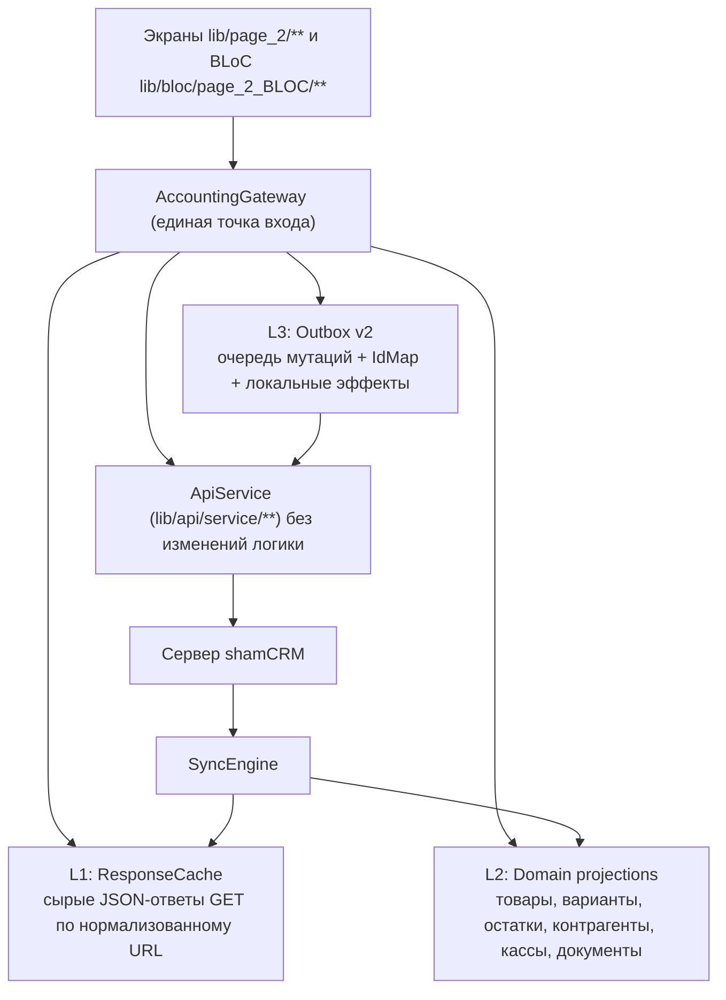

# ТЗ: shamCRM Учёт (offline-first приложение раздела «Учёт»)

Версия документа: 1.0
Дата: 2026-08-28
Базовый проект: `shamcrm_mobile` (Flutter, `lib/page_2` = раздел «Учёт»)

---

## 1. Название и позиционирование

Рекомендуемое название: **shamCRM Учёт**

- Отображаемое имя в сторах: `shamCRM Учёт` (RU) / `shamCRM Uchet` (EN/UZ)
- Подзаголовок в сторе: «Учёт и касса, которые работают без интернета»
- Внутренний идентификатор флейвора: `uchet`
- Android applicationId: `com.softtech.shamcrm.uchet`
- iOS bundle id: `com.softtech.shamcrm.uchet`

Альтернативы (если название нужно другое):

- `shamCRM Offline` — прямо про суть, но слово «offline» часть пользователей читает как «не работает»
- `shamCRM Kassa` — хорошо для базара/розницы, но сужает до РМК, а у нас весь учёт
- `shamCRM Field` / `shamCRM Автоном` — про «работу в поле», слабее узнаваемость в СНГ

Решение: основное `shamCRM Учёт`, слово «Offline» используем в маркетинге и в подзаголовке, а не в имени приложения.

---

## 2. Цель, не-цели, KPI

### 2.1 Цель

Отдельное мобильное приложение, в котором **весь раздел «Учёт»** (документы, деньги, справочники, начальные остатки, заказы, РМК) плюс **дашборд учёта** и **детальный отчёт** работают полностью при отсутствии интернета: чтение, поиск, создание, редактирование, удаление. Все изменения складываются в локальную очередь и отправляются на сервер автоматически, как только связь появится — даже если это произошло через неделю.

Пользователь никогда не видит «нет интернета — попробуйте позже». Он видит «Документ сохранён. Отправится, когда появится связь».

### 2.2 Не-цели (в этом приложении нет)

- CRM: лиды-канбан, сделки, задачи, чаты, звонки/SIP, колл-центр, план продаж, уведомления по CRM
- Онлайн-магазин как отдельный раздел (`lib/page_2/online_shop.dart`)
- Раздел `call_center` и `lib/page_2/call_center/**`
- Многопользовательская работа над одним документом (совместное редактирование)

Справочник «Клиенты» переиспользуется из CRM (`lib/screens/lead/lead_screen.dart` с флагом `isWarehouseReferenceClients: true`), но в урезанном виде: только просмотр/создание/редактирование карточки контрагента, без канбана, воронок, чатов и истории CRM.

### 2.3 KPI (приёмочные критерии)

| Метрика | Цель |
|---|---|
| Холодный старт до интерактивного экрана (офлайн, тёплый кэш) | ≤ 1.2 с |
| Открытие любого списка учёта из локальной БД (500 записей) | ≤ 250 мс |
| Поиск товара по названию/штрихкоду в каталоге 50 000 вариантов | ≤ 120 мс |
| Сохранение документа офлайн (нажал «Сохранить» → экран закрылся) | ≤ 300 мс |
| Потеря документов, созданных офлайн | 0 (жёсткое требование) |
| Дубликаты после переотправки очереди | 0 |
| Максимальный срок автономной работы без потери данных | ≥ 30 дней |
| Автоотправка очереди после появления связи | ≤ 15 с при открытом приложении |
| Размер локальной БД для тенанта с 50 000 вариантов | ≤ 60 МБ |
| Crash-free sessions | ≥ 99.7% |

---

## 3. Объём функциональности

### 3.1 Документы (создание/чтение/редактирование/удаление офлайн — всё)

| Раздел | Экраны (существующие) | Endpoint |
|---|---|---|
| РМК (касса/POS) | `lib/page_2/rmk/**` | `POST /rmk-documents`, `POST /rmk-income-documents`, `GET /rmk-documents` |
| Продажа клиенту | `lib/page_2/warehouse/client_sale/**` | `/expense-documents` |
| Возврат от клиента | `lib/page_2/warehouse/client_return/**` | `/client-return-documents` |
| Поступление товаров | `lib/page_2/warehouse/incoming/**` | `/income-documents` |
| Быстрая покупка | `lib/page_2/warehouse/incoming/fast_incoming_screen.dart` | `/rmk-income-documents` |
| Возврат поставщику | `lib/page_2/warehouse/supplier_return_document/**` | `/supplier-return-documents` |
| Перемещение | `lib/page_2/warehouse/movement/**` | `/movement-documents` |
| Списание | `lib/page_2/warehouse/write_off/**` | `/write-off-documents` |
| Производство | `lib/page_2/warehouse/manufacture/**` | `/manufacture-documents` |
| Деньги: приход (ПКО) | `lib/page_2/money/money_income/**` | `/checking-account` (`type=PKO`) |
| Деньги: расход (РКО) | `lib/page_2/money/money_outcome/**` | `/checking-account` (`type=RKO`) |
| Заказы | `lib/page_2/order/**` | `/order`, `/order/store/from-online-shop`, `/order/changeStatus/{id}` |
| Начальные остатки (товары/касса/клиент/поставщик) | `lib/page_2/warehouse/openings/**` | `/good-initial-balance`, `/cash-register-initial-balance`, `/initial-balance` |

Для всех документов офлайн должны работать также: проведение (`approve`), отмена проведения (`unApprove`), восстановление (`restore`), массовые операции (`mass-delete`, `mass-approve`, `mass-unapprove`, `mass-restore`) и история документа (из локального кэша, read-only офлайн).

### 3.2 Справочники (создание/редактирование/удаление офлайн)

Товары (`/good`), Категории (`/category`), Клиенты (`/lead`), Поставщики (`/suppliers`), Склады (`/storage`), Единицы измерения (`/unit`), Типы цен (`/priceType`), Кассы (`/cashRegister`), Статьи прихода/расхода (`/article`), Сотрудники (`/employee`), Метки (`/label`), Валюты (`/currency`, только чтение).

### 3.3 Дашборд и отчёты

- Дашборд учёта: карточки (неликвид, остаток в кассе, наши долги, нам должны) + 6 графиков (топ продаж, динамика продаж, чистая прибыль, рентабельность, структура расходов, количество заказов)
- Детальный отчёт: все 15 табов из `lib/page_2/dashboard/detailed_report/detailed_report_screen.dart`
- Офлайн-поведение описано в разделе 12

### 3.4 Оформление

Полностью переиспользуется дизайн-система `lib/core/theme/**` (`AppPalette`, токены, `context.appColors` / `appTextStyles` / `appSpacing` / `appRadius`, фоновые пресеты). Добавляются только новые элементы, описанные в разделе 11.

---

## 4. Архитектура

### 4.1 Три слоя офлайна



- **L1 ResponseCache** — универсальный слой: каждый успешный GET сохраняется как есть (тело ответа) под ключом нормализованного запроса. Офлайн любой список/деталь/отчёт отдаётся из L1 без изменений в парсерах. Это даёт 100% покрытие чтения «дешёво».
- **L2 Domain projections** — нормализованные таблицы для того, что должно быть быстрым и искомым офлайн: товары/варианты (+FTS), остатки по складам, контрагенты, кассы, склады, единицы, статьи, документы (шапки + строки). Используется для поиска, РМК, пикеров товара, расчёта остатков и локального пересчёта отчётов.
- **L3 Outbox v2** — очередь мутаций с идемпотентностью, зависимостями, ремапом временных id и локальными эффектами (остатки/касса/долги).

### 4.2 Точка перехвата

Вводится `AccountingGateway` — обёртка над `ApiService`, через которую работают BLoC раздела «Учёт». Правило: **BLoC не вызывает `ApiService` напрямую**, только `AccountingGateway`.

```
Future<T> read<T>({
  required String cacheKey,          // нормализованный ключ
  required Future<T> Function() online,
  required T Function(String rawBody) fromCache,
  required String Function(T value) toCache,
  CachePolicy policy = CachePolicy.cacheFirstThenRevalidate,
});

Future<MutationResult> write({
  required OutboxSpec spec,          // модуль, тип операции, payload, зависимости
  required Future<void> Function() online,
});
```

Поведение `write`:

1. Всегда сначала пишем операцию в `outbox_operations` (статус `pending`) и применяем локальный эффект (материализация документа + изменение остатков/касс/долгов).
2. Если сеть есть — сразу запускаем отправку этой операции (без блокировки UI).
3. UI закрывается немедленно и показывает мягкий текст (раздел 11.2).

Такой порядок («queue-first, always») исключает класс багов «онлайн упал на середине сохранения».

### 4.3 Переиспользование существующего кода

| Переиспользуем как есть | Файлы |
|---|---|
| HTTP-слой и все endpoint-методы | `lib/api/service/**` (~13 000 строк учёта) |
| Дизайн-система | `lib/core/theme/**` |
| Экраны учёта | `lib/page_2/**` (302 файла) минус `call_center`, `online_shop.dart` |
| BLoC учёта | `lib/bloc/page_2_BLOC/**`, `lib/bloc/cash_*`, `lib/bloc/income*`, `lib/bloc/expense*`, `lib/bloc/supplier_list`, `lib/bloc/lead_list` |
| Модели | `lib/models/**` |
| Общие виджеты | `lib/custom_widget/**`, `lib/page_2/widgets/**`, `lib/widgets/snackbar_widget.dart` |
| Локализация | `lib/l10n/{ru,en,uz}.json` + `AppLocalizations` |

| Пишем заново | Расположение |
|---|---|
| Entrypoint и shell | `lib/main_uchet.dart`, `lib/uchet/app/**` |
| SyncEngine | `lib/uchet/sync/**` |
| Outbox v2 | `lib/uchet/outbox/**` |
| Локальная БД (drift) | `lib/uchet/local/**` |
| AccountingGateway | `lib/uchet/gateway/**` |
| Экран «Очередь отправки» | `lib/uchet/features/queue/**` |
| Локальный пересчёт отчётов | `lib/uchet/reports/**` |

Существующая инфраструктура `lib/offline/**` (outbox v1, `NetworkProfileService`, `RequestScheduler`, `NetworkPolicy`, `OfflineRuntime`) **переиспользуется частично**: `NetworkProfileService`, `RequestScheduler`, `NetworkPolicy`, `RequestPriority` берём как есть; `OutboxService` v1 и `RmkOutboxSales` заменяются на Outbox v2 (v1 остаётся в CRM-флейворе без изменений, чтобы не сломать существующее приложение).

---

## 5. Сборка: второй флейвор в том же репозитории

### 5.1 Dart

- Новый entrypoint `lib/main_uchet.dart` (аналог `lib/main.dart`, строки 21–75), но:
  - без `safeInitializeFirebase()` для FCM-подписок CRM (Crashlytics/Analytics оставляем)
  - без SIP-инициализации и `SipCallOverlayHost`
  - `await UchetRuntime.initialize()` вместо `safeInitializeOfflineRuntime()`
  - `runApp(UchetApp(...))`
- Редакция определяется через `--dart-define`:

```dart
// lib/app/app_edition.dart
const String kAppEdition = String.fromEnvironment('APP_EDITION', defaultValue: 'crm');
bool get isUchetEdition => kAppEdition == 'uchet';
```

- В `lib/app/app_feature_flags.dart` добавить: `bool get sipEnabled => kShowSip && !AppPlatform.isDesktop && !isUchetEdition;`

Команда запуска:

```bash
flutter run --flavor uchet -t lib/main_uchet.dart --dart-define=APP_EDITION=uchet
```

### 5.2 Android (`android/app/build.gradle`)

```groovy
android {
    flavorDimensions "edition"
    productFlavors {
        crm {
            dimension "edition"
            applicationId "com.softtech.crm_task_manager"
        }
        uchet {
            dimension "edition"
            applicationId "com.softtech.shamcrm.uchet"
            resValue "string", "app_name", "shamCRM Учёт"
        }
    }
}

dependencies {
    // linphone только в CRM — экономит ~35 МБ в uchet
    crmImplementation 'org.linphone:linphone-sdk-android:5.4.106'
}
```

- `android/app/src/uchet/google-services.json` — отдельное Firebase-приложение (для Crashlytics/Analytics)
- `android/app/src/uchet/res/values/strings.xml` — `app_name`
- `android/app/src/main/AndroidManifest.xml`: `android:label="@string/app_name"`, для `crm` добавить `strings.xml` в `src/crm/`

### 5.3 iOS

- Новые build configurations: `Debug-uchet`, `Release-uchet`, `Profile-uchet`
- Новая схема `uchet` в `ios/Runner.xcodeproj/xcshareddata/xcschemes/`
- `ios/Flutter/Uchet.xcconfig`: `PRODUCT_BUNDLE_IDENTIFIER`, `PRODUCT_NAME`, `DISPLAY_NAME`, `ASSET_CATALOG_COMPILER_APPICON_NAME`
- `ios/config/uchet/GoogleService-Info.plist` + Run Script, копирующий нужный plist по `$CONFIGURATION`
- В `Info.plist` `CFBundleDisplayName = $(DISPLAY_NAME)`
- Удалить из `uchet`-конфигурации микрофон/камеру, которые нужны только SIP (камеру и микрофон оставить — нужны для сканера штрихкодов и фото товара)

### 5.4 Иконки, сплэш, версия

- `flutter_launcher_icons-uchet.yaml` + `assets/icons/uchet/` (иконка: сине-зелёный акцент из `AppPalette`, символ «чек/накладная» + маленький значок «без сети»)
- `flutter_native_splash` — отдельная конфигурация с логотипом `shamCRM Учёт`
- Версии разводим в CI через `--build-name` / `--build-number`, `pubspec.yaml` остаётся общим

### 5.5 Что не попадает в сборку uchet

`lib/screens/sip/**`, `lib/screens/chats/**`, `lib/page_2/call_center/**`, `lib/bloc/chats/**`, `lib/api/service/chats/**`, `lib/api/service/fcm/api_fcm_voip.dart` — не импортируются из `main_uchet.dart`, поэтому tree-shaking их исключит. Проверка: `flutter build apk --flavor uchet --analyze-size`, целевой размер APK ≤ 55 МБ.

---

## 6. Локальная база данных

Новый файл БД: `shamcrm_uchet.sqlite` (отдельная БД от CRM-приложения, свой класс `UchetDatabase`, `schemaVersion` с 1).

Шифрование: `sqlcipher_flutter_libs` + ключ в `flutter_secure_storage` (генерируется при первом запуске). Причина: локально лежат суммы, долги, контрагенты, остатки.

### 6.1 Служебные таблицы

```dart
// Сырые ответы GET — L1
class ResponseCache extends Table {
  TextColumn get cacheKey => text()();            // sha1(method|path|sorted_query)
  TextColumn get endpointGroup => text()();       // 'goods_list', 'dashboard_net_profit', ...
  TextColumn get body => text()();                // тело ответа как есть
  IntColumn get statusCode => integer()();
  DateTimeColumn get fetchedAt => dateTime()();
  DateTimeColumn get expiresAt => dateTime().nullable()();
  IntColumn get sizeBytes => integer()();
  @override Set<Column> get primaryKey => {cacheKey};
}

// Курсоры синхронизации
class SyncCursors extends Table {
  TextColumn get module => text()();               // 'goods', 'variants', 'clients', ...
  TextColumn get scope => text()();                // '' | 'storage:12'
  DateTimeColumn get updatedSince => dateTime().nullable()();
  IntColumn get lastPage => integer().nullable()();
  IntColumn get totalPages => integer().nullable()();
  TextColumn get state => text()();                // idle|running|done|error
  TextColumn get lastError => text().nullable()();
  DateTimeColumn get startedAt => dateTime().nullable()();
  DateTimeColumn get finishedAt => dateTime().nullable()();
  @override List<Set<Column>> get uniqueKeys => [{module, scope}];
}

// Сопоставление локальный id -> серверный id
class IdMap extends Table {
  TextColumn get entityType => text()();           // 'good', 'good_variant', 'lead', 'expense_document', ...
  TextColumn get localId => text()();              // 'L-<uuid>' или отрицательное число как строка
  IntColumn get serverId => integer().nullable()();
  DateTimeColumn get resolvedAt => dateTime().nullable()();
  @override Set<Column> get primaryKey => {entityType, localId};
}

// Настройки офлайна (выбранные склады, лимиты, режим экономии)
class UchetSettings extends Table {
  TextColumn get key => text()();
  TextColumn get value => text()();
  @override Set<Column> get primaryKey => {key};
}
```

### 6.2 Очередь (Outbox v2)

```dart
class OutboxOps extends Table {
  TextColumn get id => text()();                   // uuid v4
  TextColumn get idempotencyKey => text()();       // uuid v4, стабилен между попытками
  TextColumn get module => text()();               // 'expense_document', 'checking_account', 'good', ...
  TextColumn get operation => text()();            // create|update|delete|approve|unapprove|restore|mass_delete|...
  TextColumn get entityLocalId => text()();
  IntColumn get entityServerId => integer().nullable()();
  TextColumn get payload => text()();              // JSON с placeholder-токенами
  TextColumn get dependsOn => text().nullable()(); // JSON-массив id операций
  TextColumn get status => text()();               // pending|sending|synced|retry|failed|conflict|canceled
  IntColumn get priority => integer()();           // RequestPriority.weight
  IntColumn get attemptCount => integer().withDefault(const Constant(0))();
  DateTimeColumn get nextAttemptAt => dateTime().nullable()();
  TextColumn get lastErrorCode => text().nullable()();   // http_422, network, timeout, ...
  TextColumn get lastErrorMessage => text().nullable()();
  TextColumn get serverResponse => text().nullable()();
  TextColumn get title => text()();                // «Продажа клиенту №L-14 на 250 000»
  TextColumn get subtitle => text().nullable()();
  TextColumn get attachments => text().nullable()(); // JSON: локальные пути файлов
  DateTimeColumn get deviceCreatedAt => dateTime()();
  DateTimeColumn get createdAt => dateTime()();
  DateTimeColumn get updatedAt => dateTime()();
  DateTimeColumn get syncedAt => dateTime().nullable()();
  @override Set<Column> get primaryKey => {id};
}
```

Индексы: `(status, nextAttemptAt)`, `(module, entityLocalId)`, `(status, priority, createdAt)`.

### 6.3 Проекции каталога (L2)

```dart
class Goods extends Table {                        // товар
  IntColumn get id => integer()();                 // серверный id; локальные — отрицательные
  TextColumn get localId => text().nullable()();
  TextColumn get name => text()();
  TextColumn get article => text().nullable()();
  IntColumn get categoryId => integer().nullable()();
  IntColumn get unitId => integer().nullable()();
  BoolColumn get hasVariants => boolean().withDefault(const Constant(false))();
  TextColumn get imageUrl => text().nullable()();
  TextColumn get payload => text()();              // полный JSON товара
  DateTimeColumn get serverUpdatedAt => dateTime().nullable()();
  TextColumn get syncState => text()();            // synced|local_new|local_edited|deleted_local
  BoolColumn get isDeleted => boolean().withDefault(const Constant(false))();
  @override Set<Column> get primaryKey => {id};
}

class GoodVariants extends Table {
  IntColumn get id => integer()();
  IntColumn get goodId => integer()();
  TextColumn get name => text()();
  TextColumn get barcode => text().nullable()();
  TextColumn get article => text().nullable()();
  RealColumn get price => real().withDefault(const Constant(0))();
  RealColumn get purchasePrice => real().withDefault(const Constant(0))();
  IntColumn get unitId => integer().nullable()();
  TextColumn get payload => text()();
  TextColumn get syncState => text()();
  BoolColumn get isDeleted => boolean().withDefault(const Constant(false))();
  @override Set<Column> get primaryKey => {id};
}

class Stocks extends Table {                       // остатки
  IntColumn get variantId => integer()();
  IntColumn get storageId => integer()();
  RealColumn get serverQty => real().withDefault(const Constant(0))();
  RealColumn get localDelta => real().withDefault(const Constant(0))(); // эффект неотправленных документов
  DateTimeColumn get serverSyncedAt => dateTime().nullable()();
  @override Set<Column> get primaryKey => {variantId, storageId};
}
```

Аналогичные таблицы (id, name, payload, syncState, isDeleted, serverUpdatedAt): `Categories`, `Counterparties` (клиенты и поставщики, поле `kind`), `Storages`, `CashRegisters`, `Units`, `PriceTypes`, `Articles` (статьи прихода/расхода), `Employees`, `Labels`, `Currencies`, `OrderStatuses`.

Балансы с локальными эффектами:

```dart
class CashBalances extends Table {
  IntColumn get cashRegisterId => integer()();
  RealColumn get serverBalance => real().withDefault(const Constant(0))();
  RealColumn get localDelta => real().withDefault(const Constant(0))();
  @override Set<Column> get primaryKey => {cashRegisterId};
}

class CounterpartyBalances extends Table {
  TextColumn get kind => text()();                 // lead|supplier
  IntColumn get counterpartyId => integer()();
  RealColumn get serverBalance => real().withDefault(const Constant(0))();
  RealColumn get localDelta => real().withDefault(const Constant(0))();
  @override Set<Column> get primaryKey => {kind, counterpartyId};
}
```

### 6.4 Проекции документов

```dart
class Documents extends Table {
  TextColumn get localId => text()();              // 'L-<uuid>' для локальных, 'S-<id>' для серверных
  TextColumn get docType => text()();              // expense|income|client_return|supplier_return|movement|write_off|manufacture|rmk|checking_account|order|opening_*
  IntColumn get serverId => integer().nullable()();
  TextColumn get number => text().nullable()();
  DateTimeColumn get date => dateTime()();
  IntColumn get storageId => integer().nullable()();
  IntColumn get counterpartyId => integer().nullable()();
  IntColumn get cashRegisterId => integer().nullable()();
  RealColumn get total => real().withDefault(const Constant(0))();
  BoolColumn get approved => boolean().withDefault(const Constant(false))();
  TextColumn get comment => text().nullable()();
  TextColumn get payload => text()();              // полный JSON шапки как ждёт UI
  TextColumn get syncState => text()();            // synced|local_new|local_edited|local_deleted|failed|conflict
  TextColumn get outboxOpId => text().nullable()();
  DateTimeColumn get serverUpdatedAt => dateTime().nullable()();
  DateTimeColumn get updatedAt => dateTime()();
  @override Set<Column> get primaryKey => {localId};
}

class DocumentLines extends Table {
  TextColumn get id => text()();
  TextColumn get documentLocalId => text()();
  IntColumn get variantId => integer().nullable()();
  TextColumn get variantLocalId => text().nullable()();
  RealColumn get quantity => real()();
  RealColumn get price => real()();
  RealColumn get total => real()();
  IntColumn get unitId => integer().nullable()();
  TextColumn get payload => text()();
  @override Set<Column> get primaryKey => {id};
}
```

Индексы: `Documents(docType, date DESC)`, `Documents(syncState)`, `DocumentLines(documentLocalId)`.

### 6.5 Полнотекстовый поиск

FTS5-таблица для мгновенного поиска по каталогу:

```sql
CREATE VIRTUAL TABLE goods_fts USING fts5(
  variant_id UNINDEXED,
  good_id UNINDEXED,
  name,
  barcode,
  article,
  tokenize = 'unicode61 remove_diacritics 2'
);
```

Заполняется триггерами на `good_variants`. Поиск: `SELECT variant_id FROM goods_fts WHERE goods_fts MATCH ? LIMIT 50`. Штрихкод дополнительно ищется точным равенством по индексу `good_variants(barcode)`.

### 6.6 Хранение и очистка

| Данные | Срок хранения |
|---|---|
| Неотправленные операции очереди | бессрочно, пока не отправлены или не удалены пользователем |
| Отправленные операции (`synced`) | 30 дней, потом удаляются |
| Документы, созданные локально | бессрочно, пока не отправлены; после отправки — по общему правилу |
| Документы с сервера | 180 дней по полю `date` |
| Каталог (товары, справочники) | бессрочно, обновляется дельтой |
| `ResponseCache` | 14 дней или до 40 МБ (LRU по `fetchedAt`) |
| Локальные файлы вложений | до успешной отправки + 3 дня |

Очистка запускается при старте приложения и раз в 24 часа.

---

## 7. SyncEngine: наполнение локального хранилища

### 7.1 Стратегия по объёму данных (рекомендация)

Реализуем **один вариант, который держит и 500, и 50 000+ вариантов** — без ручного выбора со стороны пользователя в обычном случае:

- Синхронизация всегда **порционная в фоне** (страницы по 200 записей, пауза 50 мс между страницами, чтобы не блокировать UI).
- Поиск всегда идёт **по SQLite + FTS5**, а не по списку в памяти. Поэтому 50 000 вариантов работают так же быстро, как 500.
- Каталог синхронизируется **в разрезе выбранных складов**. По умолчанию — все склады, доступные пользователю. Если после первого полного прохода число вариантов превысило **30 000**, приложение показывает мягкое предложение: «Каталог большой. Оставить в офлайне только склады, где вы работаете?» с чекбоксами складов. Отказ допустим, синхронизация продолжится полностью.
- Жёсткий предохранитель: если БД превысила **300 МБ** или вариантов больше **200 000**, выбор складов становится обязательным.

Это и есть ответ на вопрос «вариант A или B»: берём B по инженерии (порционная синхронизация + FTS + лимиты), но с UX варианта A (пользователь ничего не настраивает, пока данных мало).

### 7.2 Приоритеты синхронизации

| Волна | Что | Приоритет | Когда |
|---|---|---|---|
| 0 | Отправка очереди (Outbox) | `critical` | всегда первым делом |
| 1 | Мелкие справочники: склады, кассы, единицы, типы цен, статьи, валюты, статусы заказов, сотрудники | `high` | при старте, если старше 1 часа |
| 2 | Категории, контрагенты (клиенты + поставщики) | `high` | при старте, если старше 6 часов |
| 3 | Товары и варианты + остатки по складам | `normal` | при старте, если старше 6 часов; порционно |
| 4 | Документы за последние 90 дней (шапки + строки) | `normal` | после волны 3 |
| 5 | Дашборд и детальные отчёты (снапшоты по дефолтным фильтрам) | `low` | после волны 4, только Wi-Fi или при явном запросе |
| 6 | Изображения товаров (миниатюры) | `background` | только Wi-Fi, лимит 150 МБ на диск |

Волны 1–4 обязательны для полноценного офлайна и должны укладываться в ≤ 90 с на 4G для тенанта с 10 000 вариантов.

### 7.3 Дельта-синхронизация

Запрашиваем у бэка параметр `updated_since` (см. раздел 14). Логика:

1. Читаем `SyncCursors.updatedSince` для модуля.
2. Если курсора нет — полный проход постранично, сохраняя `lastPage`/`totalPages` (устойчиво к обрыву: продолжим с той же страницы).
3. Если курсор есть — запрос `?updated_since=<ISO8601>&include_deleted=1`, применяем upsert; записи с `deleted_at != null` помечаем `isDeleted = true`.
4. По завершении прохода `updatedSince = <серверное время начала запроса>` (берём из заголовка `Date` ответа, чтобы не зависеть от часов устройства).
5. Если бэк ещё не поддерживает `updated_since`, включается fallback: полный проход раз в 24 часа + приоритетное обновление того, что открывал пользователь.

### 7.4 Триггеры синхронизации

| Событие | Действие |
|---|---|
| Старт приложения | Волна 0, затем 1–4 по устаревшим курсорам |
| `AppLifecycleState.resumed` | Волна 0; волны 1–4 если старше TTL |
| Появление сети (`NetworkProfileService.profileStream`) | Волна 0 немедленно, далее 1–4 |
| Ручное «Обновить» на экране очереди / pull-to-refresh | Волна 0 + текущий модуль |
| Таймер при открытом приложении | каждые 5 минут — волна 0 |
| Android background | `workmanager`, periodic 15 мин, только волна 0 |
| iOS background | `BGProcessingTaskRequest`, best-effort, только волна 0 |

Пользователю обещаем только гарантированный путь: «очередь уходит при открытии приложения и сразу при появлении связи». Фоновая отправка — бонус, в UI не обещаем.

### 7.5 Определение связи

Единый источник истины — `ConnectivityGate`:

```
bool get isOnline;                 // connectivity_plus != none
Future<bool> probe();              // HEAD {baseUrl}/ping с таймаутом 3 с, кэш результата 20 с
Stream<bool> get onlineStream;
```

Важно: `connectivity_plus` даёт «есть Wi-Fi», но Wi-Fi в контейнере на базаре может быть без выхода в интернет. Поэтому перед волнами 1–6 обязателен `probe()`. Для волны 0 `probe()` не обязателен — отправка сама покажет ошибку и уйдёт в retry. Запрещено использовать `InternetAddress.lookup` (как сейчас в `lib/bloc/lead/lead_bloc.dart`) — на iOS без сети он может подвиснуть до таймаута.

---

## 8. Outbox v2: очередь мутаций

### 8.1 Идемпотентность

Для каждой операции при создании генерируется `idempotencyKey` (uuid v4), который **не меняется между попытками**. Ключ отправляется в заголовке `Idempotency-Key` на все мутирующие запросы учёта. Требование к серверу — раздел 14.1.

Клиентская защита второго уровня (обязательна, работает даже без поддержки сервера):

1. Если попытка завершилась сетевой ошибкой/таймаутом (то есть неизвестно, дошёл ли запрос), перед повтором выполняем **verify-запрос**: GET по списку соответствующего типа документа с фильтром по дате и, если возможно, по контрагенту, и ищем документ с совпадающим отпечатком `fingerprint = sha1(docType|date|counterpartyId|storageId|total|отсортированные строки)`.
2. Отпечаток вычисляется один раз при создании операции и хранится в `payload._fingerprint`.
3. Если совпадение найдено — операция помечается `synced`, `serverId` подставляется из найденного документа, повтор не выполняется.
4. Если verify недоступен (нет подходящего GET) — повторяем и, при обнаружении вероятного дубликата, помечаем операцию флагом `possible_duplicate` и показываем это в очереди.

### 8.2 Порядок и зависимости

- Сортировка отправки: `priority ASC`, затем `createdAt ASC`.
- Операции над одной сущностью выполняются строго последовательно: перед отправкой берётся «блокировка» по ключу `module:entityLocalId`; вторая операция по той же сущности ждёт.
- Зависимости через `dependsOn`. Операция не отправляется, пока все зависимости не в статусе `synced`.
- Пример цепочки: пользователь офлайн создал нового клиента, затем на него продажу, затем ПКО от этого клиента. Получаем:
  1. `lead.create` (localId `L-a1`)
  2. `expense_document.create`, `dependsOn: [op1]`, в payload `lead_id: "$ref:lead:L-a1"`
  3. `checking_account.create`, `dependsOn: [op1, op2]`, `lead_id: "$ref:lead:L-a1"`

### 8.3 Ремап временных id

- Локальные сущности получают отрицательные числовые id (счётчик в `UchetSettings`, шаг −1) и строковый `localId` вида `L-<uuid>`.
- В payload ссылки на локальные сущности пишутся токеном `"$ref:<entityType>:<localId>"`.
- Перед отправкой `PayloadResolver` рекурсивно проходит JSON и заменяет токены на серверные id из `IdMap`. Если хоть один токен не разрешён — операция не отправляется, остаётся ждать (не считается ошибкой).
- После успешной отправки создающей операции сервер возвращает id (требование 14.2), пишем в `IdMap`, обновляем проекции: `Documents.serverId`, `Goods.id` (перенос с отрицательного на серверный внутри транзакции с обновлением всех ссылок).

### 8.4 Retry и dead-letter

Классификация ошибок:

| Ситуация | Код | Поведение |
|---|---|---|
| Нет сети, таймаут, DNS, 5xx, 429 | `network`, `timeout`, `http_5xx`, `http_429` | retry с backoff |
| 401 | `unauthorized` | очередь ставится на паузу, баннер «Войдите заново, очередь сохранена». Данные и очередь **не удаляются** |
| 403 | `forbidden` | `failed`, требуется действие пользователя |
| 404 (сущность удалена на сервере) | `not_found` | `conflict`, текст «Документ удалён на сервере» |
| 409 | `conflict` | `conflict`, показываем серверную версию и локальную |
| 422 / ошибки валидации | `validation` | `failed`, показываем текст сервера, кнопка «Исправить» открывает форму документа с данными из очереди |
| 400 и прочие 4xx | `bad_request` | `failed` |

Backoff: `min(30s * 2^(attempt-1), 1 час)` с джиттером ±20%. После **12 неудачных попыток** подряд по retry-ошибкам операция переходит в `failed` с пометкой «не удалось отправить», но **никогда не удаляется автоматически**.

Пауза очереди при `unauthorized` снимается автоматически после успешного логина.

### 8.5 Критично: 401 не должен стирать данные

Сейчас `ApiService._forceLogoutAndRedirect()` при 401 вызывает `prefs.clear()`. В приложении «Учёт» это недопустимо: пользователь потеряет неотправленные документы. Требуется:

- В `uchet`-редакции 401 обрабатывается через `UchetSessionGuard`: показываем экран входа, но **не чистим** ни `SharedPreferences` учётные ключи, ни локальную БД.
- Полная очистка БД возможна только при явном «Выйти из аккаунта», и только после подтверждения, если очередь не пуста: «В очереди N документов. Они будут потеряны. Продолжить?» с обязательным вводом слова подтверждения.
- Смена тенанта/организации = отдельная БД-«партиция»: все таблицы имеют неявный скоуп по `tenantKey` (домен + `organization_id`), хранящийся в `UchetSettings`. При смене тенанта данные предыдущего не показываются и не удаляются.

### 8.6 Вложения (файлы и фото)

- Локальные файлы копируются в `{appSupport}/uchet_outbox/{opId}/` сразу при создании операции — исходник в галерее может быть удалён.
- В `attachments` хранится JSON: `[{field: 'files[0][file]', path: '...', isMain: true, sizeBytes: n}]`.
- Фото сжимаются до 1600 px по длинной стороне (`flutter_image_compress`) при добавлении, а не при отправке.
- Отправка вложений идёт только при `Wi-Fi` или при явном «Отправить сейчас» пользователем; на мобильном интернете по умолчанию отправляется только текстовая часть, если endpoint это позволяет, иначе операция ждёт с понятным статусом «Ждёт Wi-Fi».
- Лимит: 25 МБ вложений на одну операцию, 500 МБ суммарно; при превышении блокируем добавление с понятным текстом.

---

## 9. Раздел «Очередь отправки»

### 9.1 Точки входа

- Отдельная иконка в нижней навигации с бейджем количества неотправленных (`pending + retry + failed + conflict`)
- Строка в профиле: «Очередь отправки — N»
- Баннер в верхней части любого экрана учёта, когда офлайн: «Нет связи. N документов ждут отправки» → тап открывает очередь

### 9.2 Экран

Три таба: **Ждут отправки**, **Ошибки**, **Отправленные**.

Карточка операции:

- Иконка типа документа + тип («Продажа клиенту», «ПКО», «Товар»)
- Заголовок: номер/локальный номер и сумма
- Контрагент/касса/склад
- Время создания (локальное, «сегодня 14:32»)
- Статус-индикатор справа:
  - `pending` — серые часы, подпись «Ждёт связи»
  - `sending` — крутящийся индикатор, «Отправляется»
  - `synced` — зелёная галочка, «Отправлено 14:35»
  - `retry` — жёлтые часы, «Повтор через 2 мин (попытка 3)»
  - `failed` — красный восклицательный знак, «Ошибка»
  - `conflict` — оранжевый знак, «Расхождение с сервером»
  - `possible_duplicate` — синий знак, «Проверьте на дубликат»
- Тап по карточке → нижний лист с деталями:
  - полный человекочитаемый текст ошибки (`lastErrorMessage`), а не `Exception: ...`
  - технические детали под раскрывающимся блоком (код, endpoint, попытки, `idempotencyKey`) — для поддержки
  - кнопки: «Повторить сейчас», «Исправить» (открывает форму с данными операции), «Открыть документ», «Удалить из очереди» (с подтверждением), «Скопировать детали»
- Свайп влево по карточке — «Повторить сейчас»

### 9.3 Верхняя панель очереди

- Статус связи: «Связь есть» / «Нет связи» / «Слабая связь»
- Кнопка «Отправить всё» (активна только при связи)
- Прогресс при активной отправке: «Отправлено 7 из 23»
- Строка «Последняя успешная синхронизация: сегодня в 09:14»

### 9.4 Правила текстов

- Никогда не показываем «Ошибка сети», если документ сохранён локально. Показываем «Сохранено. Отправим, когда появится связь».
- Все технические исключения маппятся на понятные фразы через `UchetErrorMapper`; неизвестная ошибка → «Не удалось отправить. Мы повторим попытку автоматически» + технические детали в раскрывающемся блоке.

---

## 10. Офлайн-поведение по каждому типу документа

Общее правило создания офлайн: документ материализуется в `Documents`/`DocumentLines` с отрицательным id и локальным номером формата `L-{счётчик}`; в списках он показывается первым с бейджем статуса и не отличается по вёрстке от серверного.

| Документ | Локальные эффекты | Особенности |
|---|---|---|
| РМК / Продажа клиенту | `Stocks.localDelta -= qty` по складу; `CashBalances.localDelta += оплачено`; `CounterpartyBalances.localDelta += долг` | Продажа при недостатке остатка: разрешаем, но показываем предупреждение «Остаток станет отрицательным». Блокировка — только если в настройках включён запрет |
| Возврат от клиента | `Stocks.localDelta += qty`; касса `-= возврат`; долг клиента `-=` | |
| Поступление / Быстрая покупка | `Stocks.localDelta += qty`; долг поставщику `+=`; касса `-=` при оплате | Новый поставщик и новый товар могут создаваться в той же цепочке через `$ref` |
| Возврат поставщику | `Stocks.localDelta -= qty`; долг поставщику `-=` | Партии (`good-variant-batch-remainders`) берём из локального кэша; если данных нет — предупреждаем, что партия будет уточнена на сервере |
| Перемещение | `Stocks.localDelta -= qty` (склад-источник), `+= qty` (склад-получатель) | Требует, чтобы оба склада были в локальном кэше |
| Списание | `Stocks.localDelta -= qty` | |
| Производство | материалы `-=`, продукция `+=` | |
| ПКО (приход денег) | `CashBalances.localDelta += сумма`; долг контрагента `-=` | Перемещение между кассами: два эффекта, одна операция |
| РКО (расход денег) | `CashBalances.localDelta -= сумма` | Выплата зарплаты: эффект на `Employees` баланс |
| Заказ | без эффекта на остатки; статус в локальной проекции | Смена статуса офлайн — отдельная операция `order.change_status`, идемпотентна по `(orderId, statusId)` |
| Начальные остатки | `Stocks.serverQty` не трогаем, пишем в `localDelta` | Массовая загрузка строк идёт одной операцией |
| Проведение / отмена проведения | меняет `Documents.approved` локально | Для локального (ещё не отправленного) документа не создаёт отдельную операцию, а меняет `approve` в payload исходной операции |
| Удаление | `syncState = local_deleted`, документ скрывается из списков | Для локального неотправленного документа — операция просто отменяется (`canceled`), запрос на сервер не идёт |

Отображение остатка в UI везде: `qty = serverQty + localDelta`. Если `localDelta != 0`, рядом с числом маленький значок «есть неотправленные движения» с тултипом.

После успешной отправки операции её вклад в `localDelta` снимается, и при следующей синхронизации `serverQty` подтягивается с сервера. Пересчёт `localDelta` — всегда полный пересчёт из неотправленных операций (`RecalculateLocalEffects`), а не инкрементальный, чтобы исключить дрейф.

---

## 11. UX и оформление

### 11.1 Индикация состояния связи

- Тонкая полоса под AppBar, высота 22 px, появляется анимацией 200 мс:
  - офлайн: фон `colors.warningBg`, текст «Нет связи. Работаем офлайн · N в очереди»
  - слабая связь (`lowBandwidthMode`): «Слабая связь. Отправляем по возможности»
  - идёт синхронизация: «Синхронизация 7 из 23» с линейным прогрессом
  - только что синхронизировались: зелёная полоса «Всё отправлено», исчезает через 2 с
- Никаких блокирующих модальных окон про интернет. Экран `NativeInternetAwareWrapper` (`lib/widgets/native_internet_aware_wrapper_WITH_GAME.dart`) в редакции `uchet` **отключается**.

### 11.2 Тексты при сохранении офлайн

| Действие | Текст (RU) |
|---|---|
| Документ создан офлайн | «Документ сохранён. Отправим на сервер, как появится связь» |
| Документ создан онлайн | «Документ создан» |
| Документ изменён офлайн | «Изменения сохранены. Отправим, как появится связь» |
| Удаление офлайн | «Удалено. Синхронизируем позже» |
| Продажа в РМК офлайн | «Продажа сохранена. Чек можно распечатать» |
| Первая синхронизация не завершена | «Загружаем данные для работы офлайн — 62%» с возможностью продолжить работу |

Все тексты — в `lib/l10n/{ru,en,uz}.json`, ключи с префиксом `uchet_`.

### 11.3 Экран «Офлайн-данные» (в профиле)

- Список модулей с временем последней синхронизации и количеством записей
- Кнопка «Обновить всё»
- Переключатель «Работать офлайн принудительно» (для тестов и для экономии трафика)
- Выбор складов для офлайн-каталога
- Размер локальной базы и кнопка «Очистить кэш отчётов» (не трогает очередь)
- Переключатель «Отправлять фото только по Wi-Fi» (по умолчанию включён)

### 11.4 Навигация приложения

Нижняя навигация из 4–5 пунктов вместо CRM-навигации:

1. **Учёт** — сетка документов (`WarehouseAccountingScreen`, `lib/page_2/warehouse/warehouse_screen.dart`), порядок плиток настраиваемый (уже есть, ключ `warehouse_document_order`)
2. **РМК** — сразу касса, если есть право `expense_document.create` (главный экран для розницы; можно сделать стартовым в настройках)
3. **Дашборд** — дашборд учёта + вход в детальный отчёт
4. **Очередь** — с бейджем
5. **Профиль** — организация, склад по умолчанию, тема, язык, офлайн-данные, выход

### 11.5 Печать

`lib/core/printing/accounting_print_service.dart` работает полностью офлайн (`pdf` + `printing`). Для локальных документов в шаблон подставляется локальный номер с пометкой «Черновик — не отправлен». Требование: печать чека РМК офлайн обязательна.

---

## 12. Дашборд и детальный отчёт офлайн

Три режима, в порядке приоритета:

1. **Локальный расчёт** (предпочтительно) — отчёт считается из локальных таблиц `Documents`/`DocumentLines`/`Stocks`/балансов. Данные точные и включают неотправленные документы. Применяется к:
   - Остаток в кассе (`cash-balance`)
   - Нам должны / наши долги (`debtors-list`, `creditors-list`)
   - Топ продаж (`top-selling-goods`)
   - Динамика продаж (`sales-dynamics`)
   - Количество заказов (`order/dashboard`)
   - Структура расходов (`expense-structure`)
   - Движение товара (`good-movement-history`)
   - Акт сверки (`act-of-reconciliation`)
2. **Снапшот** — для отчётов, где серверная логика сложнее клиентской (чистая прибыль, рентабельность, неликвид, отчёт по зарплате, отчёты производства): показываем последний полученный с сервера результат c явной пометкой в заголовке карточки: «Данные на 24 августа, 09:14» и иконкой «не актуально» при возрасте > 24 ч.
3. **Пустое состояние** — если снапшота нет: «Отчёт станет доступен после первой синхронизации» с кнопкой «Обновить».

Правила:

- Офлайн ни один график не показывает ошибку и не крутит бесконечный шиммер. Либо данные, либо явное состояние из п. 2/3.
- Все фильтры (период, склад, категория, контрагент) работают в локальном расчёте; в режиме снапшота недоступные комбинации фильтров помечаются «нет офлайн-данных за этот период», с кнопкой «Загрузить при связи», которая ставит запрос в очередь предзагрузки.
- Кэш снапшотов: ключ `sha1(endpoint|отсортированные фильтры)`, TTL 24 ч, но никогда не удаляется, если это последний снапшот отчёта.

---

## 13. Аутентификация и сессия

- Первый вход требует интернета: `POST https://shamcrm.com/api/get-user-by-email` → домен, затем `POST /login`.
- После входа сохраняются: `token`, `verifiedDomain`, `selectedOrganization`, `selected_sales_funnel`, `permissions`. Токен переносим из `SharedPreferences` в `flutter_secure_storage` для этой редакции.
- Последующие запуски офлайн: вход по PIN/биометрии (`AuthService`, `lib/api/service/storage/secure_storage_service.dart`) без обращения к сети. Права берутся из локальной копии `permissions`.
- Права (`permissions`) кэшируются и офлайн определяют видимость разделов. Обновляются при каждой успешной синхронизации.
- Срок жизни токена: требование к бэку — не менее 60 дней либо refresh-эндпоинт (раздел 14.5).
- Смена организации офлайн запрещена (нужен серверный список), показывается пояснение.

---

## 14. Контракт с бэкендом (короткое ТЗ для серверной команды)

### 14.1 Идемпотентность (обязательно)

- Все мутирующие запросы учёта принимают заголовок `Idempotency-Key: <uuid v4>`.
- Сервер хранит связку `(user_id, organization_id, idempotency_key) → (http_status, response_body)` **не менее 45 дней**.
- Повторный запрос с тем же ключом не создаёт новую сущность, а возвращает сохранённый ответ с заголовком `Idempotency-Replayed: true`.
- Ключ учитывается независимо от совпадения тела запроса; при том же ключе и другом теле — `409` с телом `{"error":"idempotency_key_reuse"}`.

Список endpoint'ов: `/income-documents`, `/expense-documents`, `/client-return-documents`, `/supplier-return-documents`, `/write-off-documents`, `/movement-documents`, `/manufacture-documents`, `/rmk-documents`, `/rmk-income-documents`, `/checking-account`, `/order`, `/order/store/from-online-shop`, `/order/changeStatus/{id}`, `/good`, `/category`, `/lead`, `/suppliers`, `/storage`, `/unit`, `/priceType`, `/cashRegister`, `/article`, `/employee`, `/good-initial-balance`, `/cash-register-initial-balance`, `/initial-balance`, все `approve`/`unApprove`/`restore`/`mass-*`.

### 14.2 Возврат созданной сущности (обязательно)

Сейчас часть create-методов возвращает пустое тело (например `POST /income-documents`, `POST /good-initial-balance`). Требуется, чтобы **все** create/update возвращали:

```json
{ "result": { "id": 12345, "number": "ПН-000123", "updated_at": "2026-08-28T09:14:02Z" } }
```

Без `id` в ответе невозможен ремап временных id и цепочки документов.

### 14.3 Дельта-синхронизация (обязательно для больших каталогов)

Для `/good`, `/good/get/variant`, `/category`, `/lead`, `/suppliers`, `/storage`, `/unit`, `/priceType`, `/cashRegister`, `/article`, `/employee`, `/order-status`, а также для списков документов:

- параметры `updated_since=<ISO8601>` и `include_deleted=1`
- в каждой записи поля `updated_at` и `deleted_at`
- в ответе заголовок `Date` (серверное время) — используется как новый курсор

### 14.4 Ошибки и конфликты

- Валидация: `422` с телом `{"message": "...", "errors": {"field": ["текст"]}}` — уже так, зафиксировать контрактом
- Изменение уже изменённой сущности: `409` с телом `{"error":"version_conflict","server":{...}}`
- Удалённая сущность: `404` с `{"error":"not_found"}`
- Недостаточно остатка: `422` с машинным кодом `{"error":"insufficient_stock","details":[{"variant_id":1,"available":3,"requested":5}]}`

### 14.5 Сессия

- Срок жизни токена ≥ 60 дней, либо `POST /auth/refresh`
- `401` только при реально невалидном токене (не при истечении организации/воронки)

### 14.6 Опционально (ускорит и упростит)

- `GET /sync/bootstrap?updated_since=` — один ответ со всеми мелкими справочниками (склады, кассы, единицы, типы цен, статьи, валюты, статусы заказов). Сократит первый запуск с ~12 запросов до 1.
- `GET /good/variants/bulk?updated_since=&per_page=500` — отдельный лёгкий эндпоинт только с полями, нужными для офлайн-каталога (id, good_id, name, barcode, article, price, unit_id, остатки по складам). Сократит объём трафика первой синхронизации в 3–5 раз.
- `HEAD /ping` — быстрый пробник живой связи.

Если пункты 14.1–14.3 не будут готовы к моменту релиза, приложение всё равно работает: включается клиентский fallback (verify-by-fingerprint из 8.1, полная синхронизация раз в сутки), но с риском редких дубликатов и большим трафиком. Это фиксируется как известное ограничение релиза.

---

## 15. Производительность и лимиты

- Все запросы к SQLite — через drift с `.watch()` для реактивных списков; никаких `setState` по таймеру.
- Списки — `ListView.builder` с постраничной подгрузкой из БД по 50 записей; ничего не держим целиком в памяти.
- Синхронизация каталога — в изоляте (drift `computeWithDatabase`), чтобы не было фризов UI.
- JSON-парсинг больших ответов (> 200 КБ) — в `Isolate` через `compute`.
- Ограничение параллелизма запросов берём из `NetworkProfile.maxParallelRequests` (уже реализовано).
- Бюджеты: старт ≤ 1.2 с, кадр ≤ 16 мс на скролле каталога (проверяем в profile-режиме), рост памяти на 10 000 позиций каталога ≤ 60 МБ.

---

## 16. Безопасность

- БД шифруется (SQLCipher), ключ 32 байта в `flutter_secure_storage`, при отсутствии — генерируется.
- Токен в `flutter_secure_storage`, не в `SharedPreferences`.
- Вход по PIN + биометрия обязателен (уже есть `AuthService`).
- При 10 неверных PIN — блокировка на 5 минут; локальные данные не удаляются.
- «Выйти» без интернета: предупреждение о неотправленной очереди, требуется подтверждение.
- Логи не содержат сумм, ФИО и токенов в release-сборке; `HttpLogger` только в debug (уже так).

---

## 17. Телеметрия

Дополняем существующий `OfflineTelemetryService` и отправляем в Firebase Analytics/Crashlytics агрегаты (без персональных данных):

| Метрика | Смысл |
|---|---|
| `outbox_depth` | глубина очереди при старте и в моменте |
| `outbox_op_age_p95` | возраст самой старой неотправленной операции |
| `outbox_success_rate` | доля успешных отправок |
| `outbox_failed_total` по `lastErrorCode` | причины провалов |
| `duplicate_prevented_total` | сколько дублей поймал verify/idempotency |
| `sync_duration_ms` по модулям | скорость первичной и дельта-синхронизации |
| `offline_session_share` | доля времени в приложении без сети |
| `db_size_bytes`, `catalog_rows` | рост локальной базы |
| `screen_open_ms` (кэш/сеть) | скорость экранов |

Алерты для команды: `outbox_success_rate < 95%`, `outbox_op_age_p95 > 72ч`, `duplicate_prevented_total` резкий рост.

---

## 18. QA-матрица (обязательные сценарии приёмки)

Функциональные:

1. Полный офлайн: авиарежим, создать по одному документу каждого типа из раздела 3.1, включить сеть → все ушли, все с галочкой, на сервере нет дублей.
2. Цепочка: офлайн создать нового клиента → продажу ему → ПКО от него → включить сеть → все три ушли в правильном порядке, `lead_id` подставлен верно.
3. Офлайн создать документ → офлайн отредактировать его → офлайн провести → включить сеть → на сервере одна сущность в финальном состоянии.
4. Офлайн создать документ → офлайн удалить его → включить сеть → на сервере ничего не создано, ни одного запроса.
5. Обрыв в момент отправки (kill приложения во время `sending`) → после перезапуска операция не потеряна, не отправлена дважды.
6. Слабая связь: EDGE, потеря пакетов 30%, RTT 3 с → приложение отзывчиво, очередь уходит, дублей нет.
7. Неделя офлайна: подменить дату устройства, создать 200 документов за 7 дней, включить сеть → все отправлены, порядок сохранён, БД не деградировала.
8. 401 во время отправки → очередь на паузе, данные целы, после логина очередь ушла.
9. Документ удалён на сервере, локально отредактирован → статус `conflict` с понятным текстом и вариантами действий.
10. Недостаток остатка (422) → понятная ошибка, кнопка «Исправить» открывает форму с сохранёнными данными.
11. Каталог 50 000 вариантов: поиск по названию и штрихкоду ≤ 120 мс, скролл без фризов, синхронизация не блокирует UI.
12. РМК офлайн: скан штрихкода из локального кэша, корзина, оплата, печать чека, остаток уменьшился.
13. Дашборд офлайн: локально считаемые отчёты показывают правильные числа с учётом неотправленных документов; снапшотные отчёты честно показывают дату данных.
14. Смена организации/тенанта → данные не смешались.
15. Выход из аккаунта с непустой очередью → предупреждение, отмена работает, данные целы.
16. Перезапуск во время первой синхронизации → продолжилась с той же страницы, дубликатов в БД нет.
17. Заполнение диска (< 100 МБ свободно) → понятное предупреждение, очередь продолжает работать, отключается кэш изображений.
18. Часы устройства сдвинуты на 3 дня назад/вперёд → документы уходят, порядок по `createdAt` сохранён, предупреждение о неверном времени показано.

Технические: юнит-тесты на `PayloadResolver`, `UchetErrorMapper`, `fingerprint`, классификатор ошибок, `RecalculateLocalEffects`; интеграционные тесты Outbox с мок-сервером (`http` MockClient), включая 5xx/422/409/404/таймауты; тест миграций drift.

Покрытие тестами слоёв `sync`, `outbox`, `gateway` — не ниже 80%.

---

## 19. Риски

| Риск | Влияние | Мера |
|---|---|---|
| Бэк не успеет с `Idempotency-Key` | дубликаты документов | клиентский verify-by-fingerprint (8.1) + отдельная сборка-переключатель, включающая серверную идемпотентность, когда она появится |
| Часть create-эндпоинтов не возвращает `id` | ломаются цепочки документов | до фикса бэка: после отправки делаем адресный GET списка и находим документ по отпечатку, чтобы получить `id` |
| Серверная логика расчёта отчётов отличается от локальной | расхождение цифр офлайн и онлайн | локальный расчёт только для отчётов из списка 12.1; для остальных — снапшот с датой; регрессионный тест «локально vs сервер» на эталонном тенанте |
| `lib/page_2` — 141 000 строк с прямыми вызовами `ApiService` | долгая миграция на `AccountingGateway` | миграция по модулям, порядок в разделе 20; на каждом шаге приложение остаётся работоспособным |
| Большой каталог у крупного тенанта | долгий первый запуск, размер БД | порционная синхронизация, FTS, лимиты и выбор складов (7.1) |
| Расхождение остатков из-за параллельной работы других пользователей | пользователь видит устаревший остаток | остаток всегда с пометкой времени актуальности; при появлении связи остатки обновляются первыми |
| iOS ограничивает фоновую работу | очередь не уходит с закрытым приложением | не обещаем этого в UI; уведомление-напоминание «есть N документов к отправке» при появлении сети |

---

## 20. План работ

Оценки — в человеко-днях одного разработчика, знакомого с проектом.

### Этап 0. Каркас (5 д)

- Флейвор `uchet`: Android/iOS/иконки/сплэш/имя (2 д)
- `lib/main_uchet.dart`, `UchetApp`, навигация из 5 пунктов, вход/PIN, отсечение CRM/SIP/чатов (2 д)
- `kAppEdition`, отключение `NativeInternetAwareWrapper` и SIP в этой редакции (1 д)

Готово: приложение собирается отдельно, открывает существующий раздел «Учёт» и дашборд, работает как онлайн-приложение.

### Этап 1. Локальное хранилище и SyncEngine (10 д)

- `UchetDatabase`: все таблицы раздела 6, SQLCipher, миграции, FTS5 + триггеры (3 д)
- `ConnectivityGate`, `SyncEngine`, курсоры, порционная синхронизация, волны 1–3 (4 д)
- Синхронизация документов (волна 4) и остатков (2 д)
- Экран «Офлайн-данные» + прогресс первой синхронизации (1 д)

Готово: локальная база наполняется, каталог ищется офлайн.

### Этап 2. Outbox v2 (10 д)

- Таблицы, `OutboxRepository`, `OutboxProcessor`, классификатор ошибок, backoff, dead-letter (3 д)
- `IdMap`, `PayloadResolver`, зависимости, последовательность по сущности (2 д)
- Идемпотентность + verify-by-fingerprint (2 д)
- Вложения: копирование, сжатие, «только Wi-Fi» (1 д)
- `UchetSessionGuard` (401 без стирания данных), партиционирование по тенанту (2 д)

Готово: очередь работает и надёжно отправляет; ещё не подключена к экранам.

### Этап 3. AccountingGateway и подключение модулей (18 д)

Порядок такой, чтобы ценность приходила раньше всего:

- `AccountingGateway`, `ResponseCache`, `CachePolicy`, `RecalculateLocalEffects` (3 д)
- РМК полностью офлайн (перевод с `rmk_repository.dart` на новую БД) (2 д)
- Продажа клиенту, возврат от клиента (2 д)
- Деньги: ПКО, РКО (2 д)
- Поступление, быстрая покупка (2 д)
- Перемещение, списание, возврат поставщику, производство (3 д)
- Заказы + смена статуса (1 д)
- Справочники: товары, категории, клиенты, поставщики, склады, кассы, единицы, типы цен, статьи, сотрудники (2 д)
- Начальные остатки (1 д)

Готово: весь раздел 3.1 и 3.2 работает офлайн.

### Этап 4. Очередь и UX (6 д)

- Экран «Очередь отправки», три таба, карточки, детали, действия (3 д)
- Индикация связи, бейджи, тексты, локализация RU/EN/UZ (2 д)
- Печать локальных документов с пометкой «Черновик» (1 д)

### Этап 5. Дашборд и отчёты офлайн (8 д)

- Локальный расчёт отчётов из списка 12.1 (5 д)
- Снапшоты + отображение даты актуальности + пустые состояния (2 д)
- Детальный отчёт: все табы приводятся к трёхрежимной модели (1 д)

### Этап 6. Стабилизация (10 д)

- QA-матрица раздела 18, включая тест «неделя офлайна» (4 д)
- Профилирование, оптимизация до KPI раздела 2.3 (2 д)
- Телеметрия и алерты (1 д)
- Регрессия «локально vs сервер» по отчётам (1 д)
- Подготовка сторов, скриншоты, описания, релиз 5% → 100% (2 д)

**Итого: 67 человеко-дней** (примерно 3.5 месяца одним разработчиком, 7–8 недель двумя при разделении «инфраструктура / экраны»).

Работы на стороне бэкенда (раздел 14) — параллельно, оценка серверной команды. Пункты 14.1–14.3 нужны к началу этапа 6.

### Порядок релиза

1. Внутренняя сборка (команда, 1 неделя)
2. 3–5 реальных точек с плохой связью (2 недели, ежедневный разбор телеметрии очереди)
3. 20% → 50% → 100%

Критерии перехода на следующую ступень: `outbox_success_rate ≥ 98%`, ноль подтверждённых потерь документов, ноль подтверждённых дубликатов, crash-free ≥ 99.7%.


